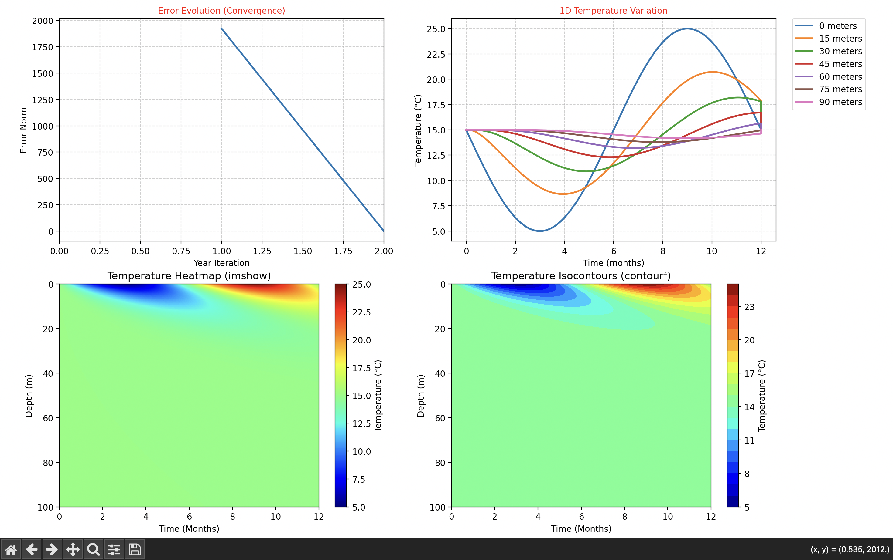

# 🌍 Subsurface Heat Diffusion Simulation

A high-performance Python implementation using **Finite Difference Methods** to simulate seasonal temperature fluctuations in rock strata. This project models the evolution of heat diffusion over multiple years to identify the **Periodic Steady State**.



## 🚀 Features

* **Numerical Solver:** Implements an explicit Forward Euler scheme for the 1D Heat Equation.
* **Stability Guaranteed:** Automatically respects the **CFL (Froude) condition** ($r < 0.5$) to prevent numerical divergence.
* **Convergence Logic:** Uses a year-over-year L2-norm comparison to ensure the model reaches a steady-state cycle.
* **Advanced Visualization:** Includes 1D depth slices, 2D heatmaps (`imshow`), and isocontour plots (`contourf`).

## 📊 The Formulas & Physics

The core of the simulation is the **1D Heat Equation**:

$$u_{t} - K u_{zz} = 0$$

### Numerical Discretization
Using the second-order central difference for space and first-order forward difference for time:

$$\frac{u_{i}^{n+1}-u_{i}^{n}}{\delta t} - K\frac{u_{i-1}^{n}-2u_{i}^{n}+u_{i+1}^{n}}{\delta z^{2}} = 0$$

### Boundary Conditions
* **Surface (z=0):** Seasonal sinusoidal variation representing annual cycles (Dirichlet):
  $$u(t,0) = 15 - 10 \sin\left(\frac{2\pi t}{S}\right)$$
* **Bottom (z=L):** Adiabatic zero-flux condition indicating no heat flow at depth (Neumann):
  $$\frac{\partial u}{\partial z} = 0$$

## ⚡ Performance Optimization: NumPy Vectorization

To achieve industry-standard performance, this project replaces expensive Python nested loops with **NumPy Vectorization**.

### Efficiency Gain
Instead of iterating through each spatial point $i$ one by one, the solver uses **Slicing and Array Broadcasting**:

## 📂 Files

* `simulation.py`: Main script containing the Finite Difference solver and visualization logic.
* `requirements.txt`: List of python dependencies (NumPy, Matplotlib).
* `images/`: Folder containing generated heatmaps and plots.
* `README.md`: Project documentation.

## 🛠️ Usage

### 1. Installation
```bash
git clone [https://github.com/theoomtzz/Explicit-finite-difference-scheme-for-the-heat-equation.git](https://github.com/theoomtzz/Explicit-finite-difference-scheme-for-the-heat-equation.git)
cd Explicit-finite-difference-scheme-for-the-heat-equation

# Create virtual env
python -m venv .venv

# Activate (Windows)
.venv\Scripts\activate
# Activate (Mac/Linux)
source .venv/bin/activate

pip install -r requirements.txt